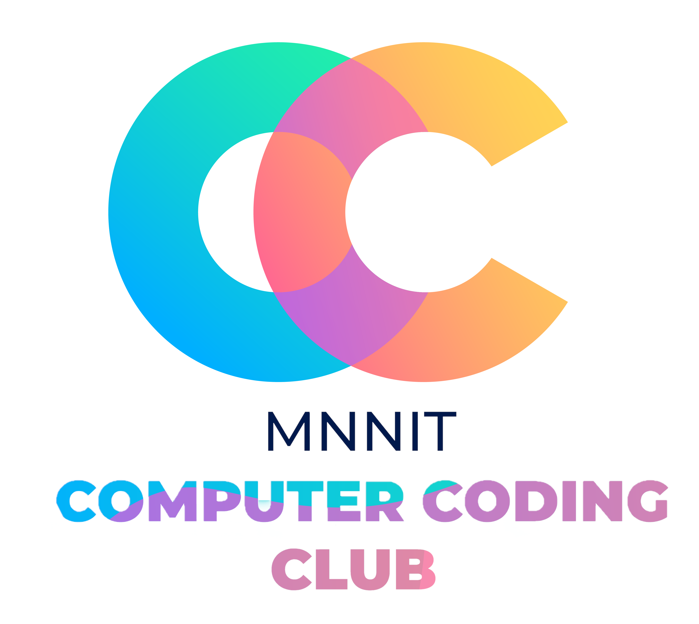

<head>
    <meta property='og:image' content='{{site.url}}/{{page.image}}'/>
    <meta property='og:type' content='website' />
</head>

# MNNIT Computer Coding Club Home

    

We are an educational club at [Motilal Nehru National Institute Of Technology, Allahabad, Prayagraj](http://www.mnnit.ac.in/) an Institute of National Importance. MNNIT Computer Coding Club as we call it is an official student organisation under Student Activity Centre (SAC) of our college.

We host several events in the domain of Computer Science And Engineering for which we also conduct classes on regular basis. Students from various courses actively participate in these events and classes throughout the year.

## Year-wise reading resources

1. [2021-22](https://github.com/CC-MNNIT/2021-22-Classes)
2. [2020-21](https://github.com/CC-MNNIT/2020-21-Classes)
3. [2019-20](https://github.com/CC-MNNIT/2019-20-Classes)
4. [2018-19](https://github.com/CC-MNNIT/2018-19-Classes)

## Events

1. [Cyberquest (Avishkar)](https://avishkar.mnnit.ac.in/events/sub_events/cyberquest/)
2. [Hack36](https://www.hack36.com/)
3. [Weekend of Code](https://woc2k21.github.io/)

## Links

- [MNNIT CC Queries Facebook Group](https://www.facebook.com/groups/ccqueries)
- [MNNIT CC Queries Official Microsoft Teams](https://bit.ly/ccqueriesteam)

## Other resources

- [College Internet/ WiFi proxy configuration](https://github.com/CC-MNNIT/proxy-settings)

## Current Representatives

Every year a small group of students from B. Tech Final year are selected to lead the Club. Currently we 7 are managing the club activities and events:

| Name                      | Reg. no. | Branch | Profile URL                            |
| ------------------------- | -------- | ------ | -------------------------------------- |
| Ashutosh Chitranshi       | 20184042 | CSE    | https://ashu12chi.github.io/           |
| Nishchal Siddharth Pandey | 20184002 | CSE    | https://nisiddharth.github.io/         |
| Mridul Bhatt              | 20184100 | CSE    | https://github.com/embiway/            |
| Sidhant Agarwal           | 20188028 | IT     | https://github.com/sidhantagar/        |
| Kshitiz Srivastava        | 20184091 | CSE    | https://github.com/pirateksh/          |
| Anushka Srivastava        | 20185020 | ECE    | https://github.com/Anushkaa-Srivastava |
| Aakanksha Khetan          | 20184025 | CSE    | https://github.com/khetan15            |

## Contact

We love to hear out suggestions. Reach out to us at [<strong>computer.club@mnnit.ac.in</strong>](mailto:computer.club@mnnit.ac.in)
